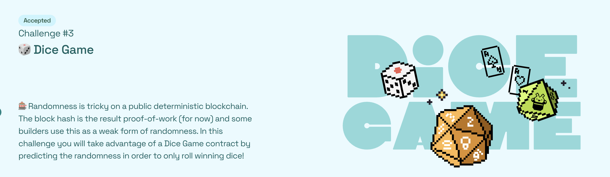

# 🏗 scaffold-eth | 🏰 BuidlGuidl

> 🎰 Randomness is tricky on a public deterministic blockchain. The block hash is an easy to use, but very weak form of randomness. This challenge will give you an example of a contract using block hash to create random numbers.  This randomness is exploitable.  Other, stronger forms of randomness include commit/reveal schemes, oracles, or VRF from Chainlink.

> 👍 One day soon, randomness will be built into the Ethereum protocol!

> 💬 Dice Game is a contract that allows users to roll the dice to try and win the prize.  If players roll either a 0, 1, or 2 they will win the current prize amount.  The initial prize is 10% of the contract's balance, which starts out at .05 Eth.  
 
> 🧤 Every time a player rolls the dice, they are required to send .002 Eth.  40 percent of this value is added to the current prize amount while the other 60 percent stays in the contract to fund future prizes.  Once a prize is won, the new prize amount is set to 10% of the total balance of the DiceGame contract. 
 
> 🧨 Your job is to attack the Dice Game contract!  You will create a new contract that will predict the randomness ahead of time and only roll the dice when you're guaranteed to be a winner!

RiggedRoll Contract
CODE: https://sepolia.etherscan.io/address/0x57A8545F20Af86Df45393c1Bcc74fa1799503B71#code

DiceGame Contract
CODE: https://sepolia.etherscan.io/address/0xb3D38eeE723851aD9FbBC227704c4B805661D6A2#code

DEMO: https://red-letters.surge.sh/

## 🚩 🎲 Dice Game  deploy on Ethereum sepolia Testnet 🚩
